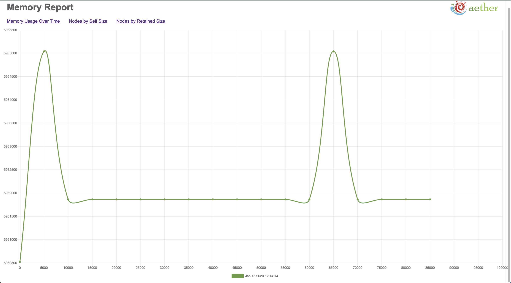
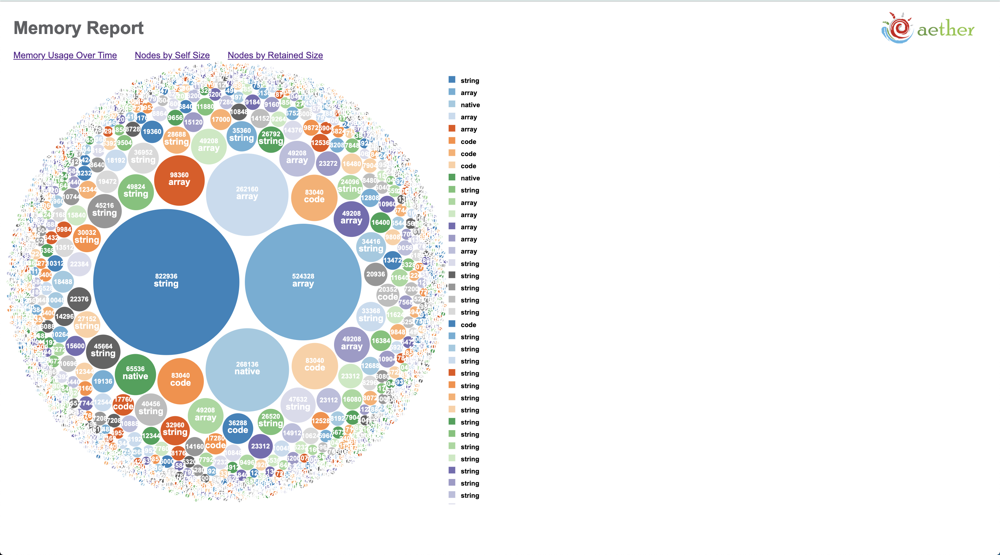

<p>
  
</p>

# aether

aether is a memory leak management tool for visualizing and tracking memory usage in real-time.

The best way to evaluate your memory footprint is to look at heap usage. There's a distinct lack of tools for debugging and profiling memory usage in Node.JS/Javascript applications, so there's still a need for a tool to synthesize data with live updates in a chart format.

After installing the `aether_memory` npm package to your server, you can observe memory usage and notice if you have a memory leak in your application, by just looking at the graph report. Once you've identified a leak, you can look at the two bubble charts to see self and retained size of nodes.

## Features

<p>
  
</p>

- Presenting total memory usage over time in a chart format with live updates every 5 seconds, so you can analyze the overall health of your application's memory.

<p>
  
</p>

- Visualizing the self size and retained size of arrays, strings, functions, and objects in your memory heap as a bubble chart to quickly see what is allocated the largest amount of memory.
---
## How it works

`aether_memory` uses `node-heapdump` to take snapshots of the heap with 5 seconds intervals. The V8 Engine triggers garbagage collection before each snapshot. The physical file is created in 'snapshot' folder and parsed through. Afterwards, the data is analyzed, displayed, and the file gets deleted before the next snapshot is taken, minimizing its own memory footprint and avoiding false results. 

---
## Installation

- Install directly in your application:

```
npm install aether_memory

```
---
## Usage

- Add this script to your package.json specifying how to start your server: 
```
"aether": "node node_modules/aether_memory/server/server.js & <START YOUR SERVER>",
```
```
FOR EXAMPLE: 

"aether": "node node_modules/aether_memory/server/server.js & node server/server.js",
```
- In your server file require and invoke aether by adding these 2 lines:
```
const aether = require('aether_memory');
aether.start();
```
- In your terminal run:
```
npm run aether
```
- Your charts will be displayed on  [localhost:9000](http://localhost:9000/)

---
## Technologies

* [node-heapdump](https://github.com/bnoordhuis/node-heapdump)
* [React](https://github.com/facebook/react)
* [Express](https://github.com/expressjs/express)
* [socket.io](https://github.com/socketio/socket.io)
* [React-Router](https://github.com/ReactTraining/react-router)
* [react-bubble-chart-d3](https://github.com/weknowinc/react-bubble-chart-d3)
* [chartjs](https://github.com/chartjs)
* [Webpack](https://github.com/webpack/webpack)
---
## Contributing and Issues

We are always looking to improve. For major changes, please open an issue first to discuss what you would like to change, pull requests are welcome.

---
## Authors

- **Anna Konstantinovich** - [@anreko](https://github.com/anreko)
- **Denis Belioglo** - [@DenisB27](https://github.com/DenisB27)
- **Sejan Miah** - [@sejdemi](https://github.com/sejdemi)
- **Vessy Shestorkina** - [@Ve33y](https://github.com/Ve33y)
---

## License
This project is licensed under the [MIT](https://choosealicense.com/licenses/mit/)